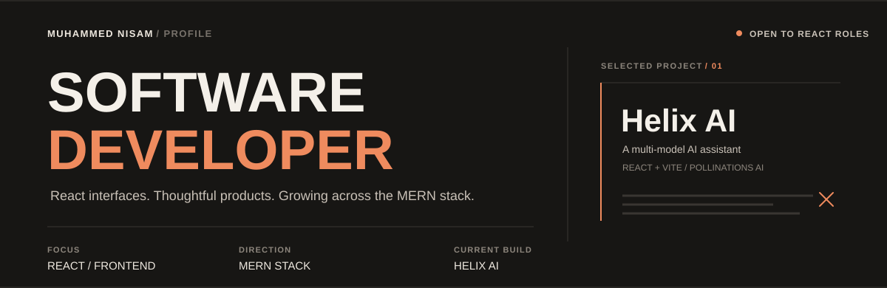

	

	

	
	
	
	
	
	
	

## EXPERIENCE

| ROLE / ORGANIZATION                                                                                  | SCOPE                                                                                                                                                                                                         | PERIOD / STATUS                 |
| :--------------------------------------------------------------------------------------------------- | :------------------------------------------------------------------------------------------------------------------------------------------------------------------------------------------------------------ | :------------------------------ |
| **Software Engineer Trainee** Cyber Square AI & Robotics Pvt. Ltd. Calicut, India              | Architected full-stack MERN cloud applications, modular REST API services, and reactive user interfaces. Implemented robust NoSQL state persistence schemas and authentication pipelines.                     | Jan 2025 – Jul 2025 VERIFIED |
| **Web Developer** Carolina Canovic Information Technology L.L.C (ActLocal) Remote (Dubai, UAE) | Engineered and launched 100+ high-converting commercial landing pages with lightning load times (&lt;1.2s FCP). Managed and maintained 25+ high-traffic e-commerce client storefronts across the Gulf region. | Jan 2024 – Jun 2024 PUBLIC   |

## TOOLBOX

	

| TOOL               | DESCRIPTION            | TOOL              | DESCRIPTION           |
| :----------------- | :--------------------- | :---------------- | :-------------------- |
| **JavaScript**     | Core Logic & ES6+      | **React.js**      | Component Frontend    |
| **TypeScript**     | Static Type Engine     | **Next.js**       | Full-Stack SSR & App  |
| **Node.js**        | Backend Runtime        | **Express.js**    | REST Backend Server   |
| **MongoDB**        | NoSQL Cluster & ODM    | **Redux Toolkit** | Predictable App State |
| **Tailwind CSS**   | Utility Styling Engine | **Bootstrap**     | Responsive UI Grid    |
| **HTML5**          | Semantic Structure     | **CSS3**          | Modern Web Layouts    |
| **Postman / REST** | API Testing & Specs    | **Git & CI/CD**   | Version Control & Ops |

## EDUCATION

| PROGRAM                                       | INSTITUTION                                    | PERIOD                    |
| :-------------------------------------------- | :--------------------------------------------- | :------------------------ |
| **Visual Design & Media Production**          | Pixalight Media Academy                        | Sep 2025 – Jan 2026       |
| **MERN Stack Internship**                     | Cyber Square International                     | Feb 2025 - Aug 2025       |
| **Master of Computer Applications (MCA)**     | Indira Gandhi National Open University (IGNOU) | Progressing (2025 – 2027) |
| **Digital Marketing & WordPress Development** | Opentutor Academy, Kannur                      | May 2023 – Aug 2023       |
| **Bachelor of Business Administration (BBA)** | Calicut University                             | 2019 – 2022               |
