 

I'm **Muhammed Nisam**, a **React / Frontend Developer** building my way toward strong **MERN stack** capability. My day-to-day is component-driven UIs in **React.js** — state management, routing, responsive layouts — wired up to **Node.js / Express / MongoDB** APIs on the backend. I care about interfaces that stay clean and maintainable as they grow, not just ones that look right on day one. Right now I'm pairing that with an MCA (2024–2026) to round out the fundamentals behind the frontend work.

 

 

**Frontend — primary focus**

React.js · JavaScript (ES6+) · TypeScript · HTML5 · CSS3 · Tailwind CSS · Bootstrap · React Router · Redux Toolkit

**Backend & MERN**

Node.js · Express.js · MongoDB · Mongoose · REST APIs

**Tooling & Web Platforms**

Git · GitHub · VS Code · Postman · npm · Yarn · WordPress · WooCommerce · Shopify

 

<table>
<tr><td width="50%" valign="top">

**Education**

| Program | Institution        | Period                      |
| ------- | ------------------ | --------------------------- |
| MCA     | Distance Education | 2024 – 2026 · _in progress_ |
| BBA     | Calicut University | 2019 – 2022                 |

</td><td width="50%" valign="top">

**Focus areas**

- React.js frontend development
- MERN stack (Node.js, Express, MongoDB)
- REST API design & integration
- WordPress / WooCommerce / Shopify

</td></tr>
</table>

 

<strong>Helix</strong> → an AI resume builder web app · repo and live link to be added below once published

 

 

 

⭐ Thanks for visiting — always open to a conversation about React and web development.

